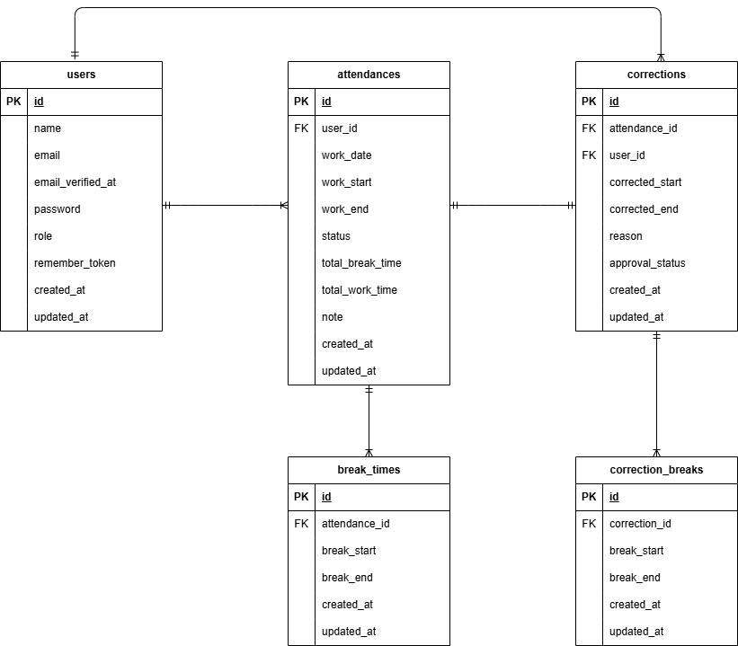

# 勤怠管理アプリ（worklog-system）

Laravelを使用した**勤怠管理システム**です。
従業員の **出勤・退勤・休憩の記録** および **勤怠修正申請の管理機能** を備えています。

本アプリは**coachtechの模擬案件課題**として開発されました。
一般ユーザーは日々の勤怠を管理し、誤りがあった場合は修正申請を行うことができます。
管理者は、申請内容を確認し、承認を行います。

一般ユーザーと管理者で **画面・ルーティング・認証処理・遷移先を完全に分離**し、より実践的な権限設計を再現しています。
Docker 環境で動作するため、ローカルで起動・テストが可能です。

---

## 1. アプリ概要

- 出勤/退勤/休憩を記録する勤怠システム
- 修正申請 → 管理者承認というワークフロー
- ロールごとにログイン画面・遷移先・権限制御を分離
- メール認証機能（一般ユーザーのみ）
- Docker で開発環境を統一
- PHPUnit による **全 65 テスト通過済み**

---

## 2. 主要機能

### 2-1. 一般ユーザー機能

- 新規登録（メール認証付き）
- ログイン/ログアウト
- 出勤・退勤
- 休憩開始/休憩終了（複数回対応）
- 勤怠一覧（月次）
- 勤怠詳細表示
- 勤怠修正申請の作成
- 修正申請一覧（承認待ち/承認済み）

### 2-2. 管理者機能

- 管理者ログイン（役割チェックあり）
- 当日勤怠一覧
- スタッフ一覧
- スタッフ別月次勤怠一覧
- CSV ダウンロード機能（当月勤務をエクスポート）
- 勤怠詳細表示・修正
- 修正申請の確認・承認
- 申請承認時に：
 - attendances を上書き更新
 - 既存 break_times 削除 → correction_breaks で再構築
 - 合計勤務・休憩時間を再計算

### CSV出力機能について
- 管理者はスタッフ別勤怠一覧画面から CSV 出力が可能
- 対象月の勤怠情報のみを UTF-8 形式でダウンロード
- ルートは `/admin/attendance/staff/{id}` のまま使用

---

## 3. 画面一覧

### 3-1. 一般ユーザー
| 画面     | 役割               | URL                              |
| -------- | ------------------ | -------------------------------- |
| 勤怠登録 | 出勤・退勤・休憩   | `/attendance`                    |
| 勤怠一覧 | 月次一覧           | `/attendance/list`               |
| 勤怠詳細 | 勤務内容の詳細表示 | `/attendance/detail/{id}`        |
| 申請一覧 | 修正申請履歴       | `/stamp_correction_request/list` |

### 3-2. 管理者
| 画面               | 役割                     | URL                                                                 |
| ------------------ | ------------------------ | ------------------------------------------------------------------- |
| 管理者ログイン     | 認証                     | `/admin/login`                                                      |
| 当日勤怠一覧       | 全スタッフの今日の勤怠   | `/admin/attendance/list`                                            |
| スタッフ一覧       | 一覧                     | `/admin/staff/list`                                                 |
| スタッフ別月次一覧 | 月別勤怠                 | `/admin/attendance/staff/{id}`                                      |
| 勤怠詳細           | 勤務内容の詳細表示・修正 | `/admin/attendance/{id}`                                            |
| 修正申請一覧       | 承認待ち/承認済み        | `/stamp_correction_request/list`                                    |
| 修正内容確認       | 申請承認                 | `/stamp_correction_request/approve/{attendance_correct_request_id}` |

---

## 4. 使用技術 / 環境

| 項目           | 内容                                           |
| -------------- | ---------------------------------------------- |
| 言語           | PHP 8.1.33                                     |
| フレームワーク | Laravel 8.83.8                                 |
| データベース   | MySQL 8.0.26                                   |
| サーバー       | Nginx 1.21.1                                   |
| コンテナ管理   | Docker / docker-compose                        |
| 認証           | Laravel Fortify                                |
| メールテスト   | MailHog (Docker image: mailhog/mailhog:latest) |
| テスト         | PHPUnit                                        |
| 日付管理       | Carbon                                         |

---

## 5. 環境構築
DockerとLaravelの設定手順です。

### 5-1. Docker 構築

1. リポジトリをクローン
```bash
git clone git@github.com:ayako1179/worklog-system.git
cd worklog-system
```
2. DockerDesktopアプリを立ち上げる
3. コンテナをビルド・起動
```bash
docker-compose up -d --build
```

> *MacのM1・M2チップのPCの場合
ビルド時に以下のエラーが発生する場合があります：
`no matching manifest for linux/arm64/v8 in the manifest list entries`
対処法として、`docker-compose.yml`の`myspl`内に以下を追加してください。
```yaml
platform: linux/x86_64
# この行を追加
```

### 5-2. Laravel セットアップ
1. PHPコンテナに入る
```bash
docker-compose exec php bash
```
2. composer インストール
```bash
composer install
```
3. 環境ファイルを作成
「.env.example」ファイルを 「.env」ファイルに命名を変更。または、新しく.envファイルを作成
```bash
cp .env.example .env
```
4. .envに以下の環境変数を設定
``` text
APP_URL=http://localhost:8081

# --- Database Settings ---
DB_CONNECTION=mysql
DB_HOST=mysql
DB_PORT=3306
DB_DATABASE=laravel_db
DB_USERNAME=laravel_user
DB_PASSWORD=laravel_pass

# --- MailHog Settings ---
MAIL_MAILER=smtp
MAIL_HOST=mailhog
MAIL_PORT=1025
MAIL_USERNAME=null
MAIL_PASSWORD=null
MAIL_ENCRYPTION=null

# 送信元メールアドレス（必須）
MAIL_FROM_ADDRESS=worklog@example.com
MAIL_FROM_NAME="Worklog System"
```
5. アプリケーションキーの作成
``` bash
php artisan key:generate
```

6. マイグレーションの実行
``` bash
php artisan migrate
```

7. シーディングの実行
``` bash
php artisan db:seed
```
---

## 6. 認証仕様（Laravel Fortify）

本アプリの認証機能は **Laravel Fortify** を使用しています。
一般ユーザーと管理者で認証フローや遷移先が異なるため、以下にまとめます。

---

### 6-1. ログイン仕様

#### ■ 一般ユーザー
- `/login` からログイン
- 新規登録後、**メール認証が必須**
- 未認証の場合は
  → **メール認証誘導画面（verification.notice）へ自動リダイレクト**
- 認証済みの場合
  → `/attendance` へ遷移

#### ■ 管理者
- `/admin/login` からログイン
- シーディング時点でメール認証済みとして作成
- 一般ユーザーが管理者ログイン画面からログインすることは不可
  （Fortify の `authenticateUsing` で role 判定）

#### ■ パスワード・バリデーション
- 8文字以上必須
- メールアドレス形式チェック
- 未認証 / ロール不一致 / パスワード不一致は統一したメッセージ
**「ログイン情報が登録されていません」** を返却

---

### 6-2. ログアウト時の制御

ログアウト時はユーザーのロールを判定し、以下へ遷移します。

| ロール       | 遷移先         |
| ------------ | -------------- |
| 一般ユーザー | `/login`       |
| 管理者       | `/admin/login` |

この制御には
**`StoreLogoutUserRole` ミドルウェア + Fortify の LogoutResponse 上書き**
を使用しています。

---

### 6-3. メール認証

一般ユーザーは **新規会員登録後、登録メールアドレスに認証メールが送信されます**。
メール認証が完了していない場合、ログインはできず、以下の動作になります。

- **未認証 → メール認証誘導画面へ自動リダイレクト**
- **認証済み → 通常通りログイン可能**

管理者アカウントはシーディング時点で **認証済み（email_verified_at がセット済み）** のため、メール認証は不要です。

> **※補足（Seeder について）**
> `db:seed` により作成される一般ユーザー 6 名は、動作確認を円滑に行うため
> **すべて認証済み（email_verified_at がセットされた状態）** として登録されています。
> 実際のメール認証フローを確認したい場合は、新規登録画面からユーザーを作成してください。

---

### 6-4. ロール別遷移先

| ロール       | 遷移先                   |
| ------------ | ------------------------ |
| 一般ユーザー | `/attendance`            |
| 管理者       | `/admin/attendance/list` |

Fortify の `LoginResponse` を上書きして実装しています。

---

## 7. 勤怠処理の仕様

本アプリの勤怠データは **attendances / break_times / corrections /correction_breaks** によって管理されます。
以下は、画面の動きやデータ更新の流れをまとめています。

---

### 7-1. 出勤・退勤の処理

- 出勤は **1 日 1 回のみ**
- 出勤打刻時に attendances レコードが作成される
- 出勤後の状態は `present` （出勤中）
- 退勤打刻後は `finished` （退勤済）に更新
- 退勤済の日付には **再度出勤できない**
- 出勤を削除してやり直す機能はありません

---

### 7-2. 休憩の処理

- 出勤中のみ「休憩入」ボタンが表示
- 休憩中は「休憩戻」ボタンが表示
- 休憩は **複数回登録可能**
- 休憩1回ごとに break_times に
  `break_start / break_end` を保存
- 合計休憩時間は、すべての休憩をもとに自動計算される

---

### 7-3. 勤怠詳細画面（一般ユーザー）

- **勤怠レコードが存在する日付のみ** 詳細画面へ遷移可能
- 以下のような日付は勤怠詳細へ遷移できない
  - 過去に出勤打刻していない日
  - 出張・特別休暇などで勤怠レコードが存在しない日
  - 未来の日付
- 当日の勤怠を「後から新規追加する機能」は存在しない
  → 出勤ボタンが唯一のレコード生成フロー
- 勤怠の修正は **修正申請機能（後述）** のみで行う

---

### 7-4. 修正申請（一般ユーザー）

一般ユーザーは **attendance を直接編集できません**。
修正したい場合は「申請」として登録します。

1. **勤怠詳細画面で修正内容を入力**
   （出勤時刻・退勤時刻・休憩時間・備考を編集）
2. `corrections` / `correction_breaks` に申請として保存
3. attendances.status が `pending` （承認待ち）に更新
4. 管理者が確認するまで attendances テーブルの内容は変わらない
5. 管理者が承認すると attendances が申請内容で更新され
   修正申請（corrections）は `approved` になる

---

### 7-5. 修正申請の承認（管理者）

管理者が申請を承認すると、以下の処理が行われます。

- 出勤・退勤・備考を attendances に反映
- break_times は
  **既存レコードをすべて削除 → correction_breaks の内容で再登録**
- 合計休憩時間・勤務時間を再計算して保存
- corrections.approval_status を `approved` に更新
- attendances.status を `approved` に更新

承認済み申請は再承認できません。

---

### 7-6. 管理者による直接修正

管理者は、修正申請フローを経由せずに勤怠を直接編集できます
（一般ユーザーとは異なる管理者権限のため）。

**編集可能な項目**
- 出勤時刻
- 退勤時刻
- 休憩（既存の編集＋新規追加）
- 備考

**保存時の処理**
- 休憩時間をすべて集計
- 勤務時間を再計算
- total_break_time / total_work_time を保存
- 保存後は画面に
  **「修正が完了しました」メッセージを表示**

---

### 7-7. 補足

- 当日の勤怠を後から追加する機能はありません
- 勤怠レコードがない日付には修正申請はできません
- 申請内容は承認されるまで attendances に反映されません

---

## 8. テーブル仕様書

### 8-1. users テーブル
| カラム名          | 型              | NOT NULL | 備考          |
| ----------------- | --------------- | -------- | ------------- |
| id                | unsigned bigint | ○        | 主キー        |
| role              | varchar(20)     | ○        | staff / admin |
| name              | varchar(255)    | ○        |               |
| email             | varchar(255)    | ○        | UNIQUE        |
| email_verified_at | datetime        |          | 認証日時      |
| password          | varchar(255)    | ○        |               |
| remember_token    | varchar(100)    |          |               |
| created_at        | timestamp       | ○        |               |
| updated_at        | timestamp       | ○        |               |

---

### 8-2. attendances テーブル
| カラム名         | 型              | NOT NULL | 備考      |
| ---------------- | --------------- | -------- | --------- |
| id               | unsigned bigint | ○        | 主キー    |
| user_id          | unsigned bigint | ○        | users(id) |
| work_date        | date            | ○        | 勤務日    |
| work_start       | time            | ○        | 出勤時刻  |
| work_end         | time            |          | 退勤時刻  |
| status           | varchar(20)     | ○        | 勤怠状態  |
| total_break_time | time            |          | 休憩合計  |
| total_work_time  | time            |          | 勤務合計  |
| note             | varchar(255)    |          | 備考      |
| created_at       | timestamp       | ○        |           |
| updated_at       | timestamp       | ○        |           |

### 複合ユニーク制約
- UNIQUE (user_id, work_date)

---

### 8-3. break_times テーブル
| カラム名      | 型              | NOT NULL | 備考            |
| ------------- | --------------- | -------- | --------------- |
| id            | unsigned bigint | ○        | 主キー          |
| attendance_id | unsigned bigint | ○        | attendances(id) |
| break_start   | time            | ○        | 休憩開始時刻    |
| break_end     | time            |          | 休憩終了時刻    |
| created_at    | timestamp       | ○        |                 |
| updated_at    | timestamp       | ○        |                 |

---

### 8-4. corrections テーブル
| カラム名        | 型              | NOT NULL | 備考                   |
| --------------- | --------------- | -------- | ---------------------- |
| id              | unsigned bigint | ○        | 主キー                 |
| attendance_id   | unsigned bigint | ○        | attendances(id)        |
| user_id         | unsigned bigint | ○        | users(id)              |
| corrected_start | time            |          | 修正申請された出勤時刻 |
| corrected_end   | time            |          | 修正申請された退勤時刻 |
| reason          | text            | ○        | 修正理由               |
| approval_status | varchar(20)     | ○        | pending / approved     |
| created_at      | timestamp       | ○        |                        |
| updated_at      | timestamp       | ○        |                        |

---

### 8-5. correction_breaks テーブル
| カラム名      | 型              | NOT NULL | 備考                   |
| ------------- | --------------- | -------- | ---------------------- |
| id            | unsigned bigint | ○        | 主キー                 |
| correction_id | unsigned bigint | ○        | corrections(id)        |
| break_start   | time            |          | 修正申請された休憩開始 |
| break_end     | time            |          | 修正申請された休憩終了 |
| created_at    | timestamp       | ○        |                        |
| updated_at    | timestamp       | ○        |                        |

---

## 9. ER図


---

## 10. テスト仕様

本アプリでは、主要な業務フローが正しく動作することを確認するため、
以下の **4カテゴリ・全16項目** を中心に Feature テストを実装しています。

---

### A. 認証・権限制御
一般ユーザー・管理者のログインまわりの挙動を確認します。
- 認証機能（一般ユーザー）
- ログイン認証機能（一般ユーザー）
- ログイン認証機能（管理者）
- メール認証機能

---

### B. 勤怠の基本機能（一般ユーザー）
毎日の打刻フローが正しく動作するかを確認します。
- 日時取得機能
- ステータス確認機能（勤務外/出勤中/休憩中/退勤済）
- 出勤機能（1日1回）
- 休憩機能（休憩入/休憩戻）
- 退勤機能

---

### C. 勤怠閲覧・修正（一般ユーザー）
自分の勤怠情報を見る・修正申請を行えるかを確認します。
- 勤怠一覧情報取得機能（一般ユーザー）
- 勤怠詳細情報取得機能（一般ユーザー）
- 勤怠詳細情報修正機能（一般ユーザー）

---

### D. 勤怠閲覧・修正・更新（管理者）
管理者がスタッフの勤怠を確認・修正・承認を行えるかを確認します。
- 勤怠一覧情報取得機能（管理者）
- 勤怠詳細情報取得・修正機能（管理者）
- ユーザー情報取得機能（管理者）
- 勤怠情報修正機能（管理者）

---

## 11. テスト環境構築と実行方法

本アプリのテストは PHPUnit を使用して実行します。
テストは **専用のテスト用データベース** を使用するため、本番データは影響を受けません。

---

### 11-1. `.env.testing` の作成

プロジェクト直下に `.env.testing` を作成し、以下を記述してください。

```text
DB_CONNECTION=mysql
DB_HOST=mysql
DB_PORT=3306
DB_DATABASE=worklog_test
DB_USERNAME=root
DB_PASSWORD=root
```

---

### 11-2. テスト用データベースの作成

```bash
# MySQLコンテナに接続
docker-compose exec mysql bash

# MySQLへログイン
mysql -u root -proot

# テスト用データベースの作成
CREATE DATABASE `worklog_test` CHARACTER SET utf8mb4 COLLATE utf8mb4_unicode_ci;

EXIT;
```

---

### 11-3. テスト実行手順

```bash
# PHPコンテナに入る
docker-compose exec php bash

# マイグレーションを実行（テスト用DB）
php artisan migrate --env=testing

# 全テストを実行
php artisan test

# 結果をファイルに出力（任意）
php artisan test > tests/results.txt
```

---

### 11-4. 補足
- テスト実行時は **毎回 worklog_test を使用** します
- 本番DB（laravel_db）には影響しません
- RefreshDatabase トレイトにより
  **テストごとにテーブルが自動で初期化** されます

※ 本アプリのテストは PHPUnit により自動化されています。
開発時点の主要機能はすべてテスト可能な状態です。

---

## 12. 初期ログイン情報

### 管理者アカウント
| 種別   | メールアドレス      | パスワード |
| ------ | ------------------- | ---------- |
| 管理者 | admin@coachtech.com | adminpass  |

---

### 一般ユーザーアカウント

本アプリでは `db:seed` 実行時に **複数の一般ユーザーが自動生成** されます。
そのうち 1 名の例を以下に掲載します（動作確認用）。

| 種別         | メールアドレス        | パスワード |
| ------------ | --------------------- | ---------- |
| 一般ユーザー | reina.n@coachtech.com | password1  |

---

## 13. URL一覧
- アプリケーション：http://localhost:8081/
- phpMyAdmin:：http://localhost:8080/
- MailHog（メール確認用）：http://localhost:8025/

---

## 14. 作者情報
作成者：Ayako
GitHub：[https://github.com/ayako1179](https://github.com/ayako1179)
